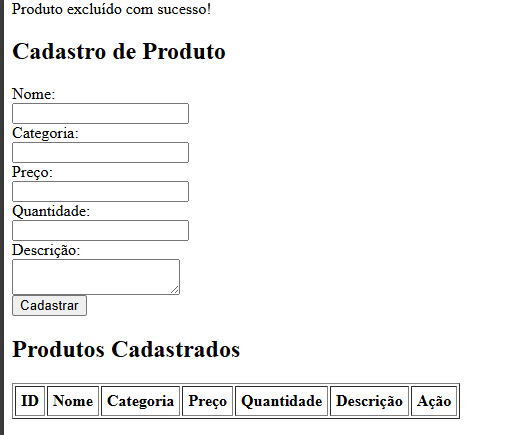
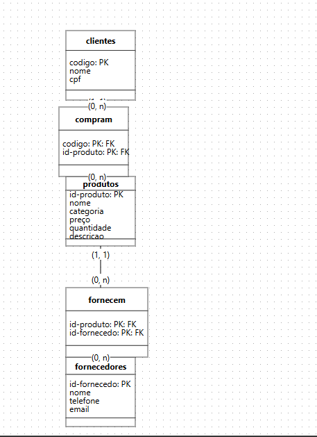

Sistema de Cadastro de Produtos em PHP com MySQL

Este projeto é um sistema básico de CRUD (Create, Read, Update, Delete) feito em PHP, com banco de dados MySQL. Ele permite cadastrar, visualizar e excluir produtos de uma tabela chamada produtos.

🚀 Funcionalidades

✔ Cadastro de produtos com:

Nome

Categoria

Preço

Quantidade

Descrição

✔ Listagem dos produtos cadastrados
✔ Exclusão de produtos através de link com confirmação

🏗 [Clique aqui para ver o código PHP](index.php)

🏗 Estrutura do Banco de Dados

A tabela produtos deve existir no banco loja_recuperacao com os seguintes campos:

CREATE TABLE produtos (
    id INT AUTO_INCREMENT PRIMARY KEY,
    nome VARCHAR(100),
    categoria VARCHAR(100),
    preco DECIMAL(10,2),
    quantidade INT,
    descricao TEXT
);

🔧 Como o Código Funciona
1️⃣ Conexão com o Banco de Dados

O script se conecta ao MySQL usando PDO:

$pdo = new PDO("mysql:host=$host;dbname=$dbName", $user, $pass);

2️⃣ Inserir Produto

Quando o usuário envia o formulário (POST), o produto é cadastrado no banco:

$sql = $pdo->prepare("INSERT INTO produtos (...) VALUES (...)");

3️⃣ Excluir Produto

A exclusão ocorre através de um link com parâmetro ?excluir=id:

$pdo->prepare("DELETE FROM produtos WHERE id = ?")->execute([$idExcluir]);

4️⃣ Listagem dos Produtos

Todos os produtos são recuperados e exibidos em uma tabela HTML:

$produtos = $pdo->query("SELECT * FROM produtos ORDER BY id DESC")->fetchAll();

📄 Interface do Usuário

O sistema exibe:

Um formulário para cadastrar novo produto

Uma tabela com todos os produtos já registrados

Um botão para excluir produtos com confirmação

📌 Observações

Este é um projeto simples ideal para aprendizado de PHP + MySQL.

Usou PDO para maior segurança contra SQL Injection.

Pode ser expandido futuramente com edição de produtos (UPDATE), login, e layout moderno. 

imagens do sistema

